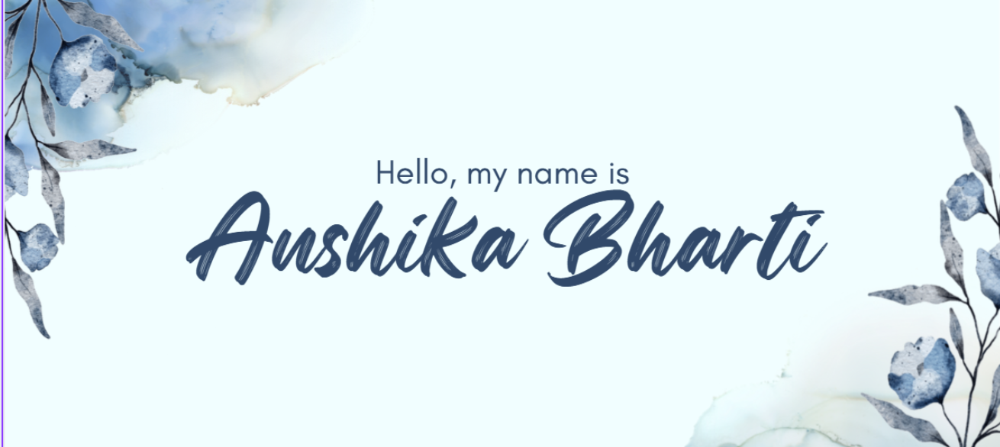

<!-- 👇 Yaha apni image ka link daalo -->

  

<h1 align="center">Hi 👋, I'm Anshika Bharti</h1>
<h3 align="center">B.Tech IT Student | Aspiring Software Developer</h3>

---

## 🚀 About Me

I'm a 3rd Year B.Tech Information Technology student with a strong interest in **Web Development**.

I enjoy designing and building interactive web applications using **HTML, CSS, and JavaScript**. I love turning ideas into real projects and continuously improving my development skills through hands-on practice.

- 🔭 I’m currently working on **Frontend projects**
- 🌱 I’m currently learning **JavaScript concepts & interactive UI**
- 👯 I’m looking to collaborate on **Frontend & beginner open-source projects**
- 🤔 I’m looking for help with **UI/UX & responsive design**
- 💬 Ask me about **HTML, CSS, JavaScript, Python basics**
- 📫 How to reach me: **LinkedIn**
- 😄 Pronouns: **She/Her**
- ⚡ Fun fact: I enjoy designing creative webpages & experimenting with layouts

---

## 🛠 Tech Stack

**Languages:**  
C++ | Python | JavaScript  

**Web Technologies:**  
HTML | CSS  

**Tools:**  
Git  

---

## 💻 My Projects

- 🤖 AI Chatbot using Gemini API  
- 🕹️ Tetris Game using JavaScript  
- 🌐 Parallax Website using HTML & CSS  
- ⏰ Digital Clock using Python  

---

### ⚙️ Tech Stack

C++ | Python | HTML | CSS | JavaScript | NumPy

---

### 📊 GitHub Stats

---

### 🔗 Connect with me

- LinkedIn
- LeetCode
- GitHub
